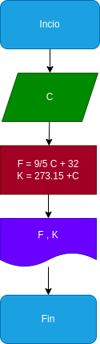

# Temperatura
programa de temperatura para realizar conversiones de temperatura
## calcular mediante grados celcius los grados fahrenheit y los grados kelvin

# analisis

variables de entrada

c: grados celcius o centigrados

variables de salida

f: grados fahrenheit
k: grados kelvin

# Diseño

# CONSTRUCCION